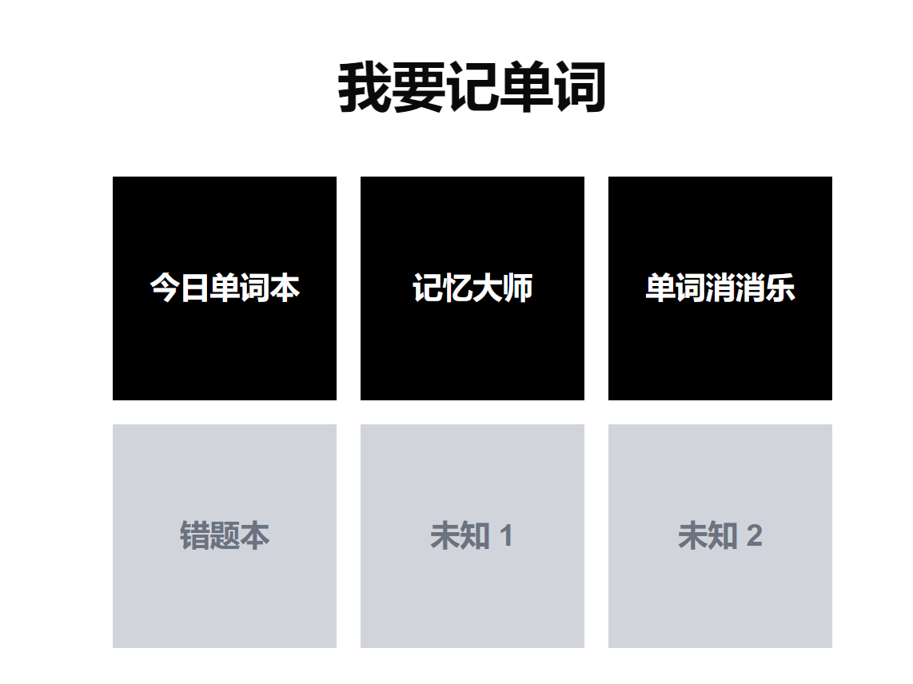

# 我要记单词！

这是一个专为学习英语单词设计的应用程序，旨在通过多种有趣的方式帮助用户更有效地记忆和掌握英语单词。

## 主要功能

1. **每日单词**：每天推送新的单词，帮助用户逐步扩大词汇量。

2. **单词本**：用户可以将学习过的单词添加到个人单词本中，方便复习和管理。

3. **记忆大师**：通过生成包含用户选择单词的有趣故事，帮助用户更好地记忆单词。故事类型多样，包括现实主义、科幻、魔幻现实主义等，让学习过程更加生动有趣。

4. **单词消消乐**：将单词学习融入游戏中，通过匹配单词及其释义来消除方块，既有趣又能加深记忆。

5. **错题本**：记录用户在学习过程中出现的错误，便于针对性复习和改进。

## 技术特点

- 使用Next.js框架开发，确保良好的性能和用户体验。
- 采用响应式设计，适配各种设备屏幕。
- 集成AI技术，用于生成个性化的记忆故事。
- 简洁直观的用户界面，操作便捷。

通过这些多样化的功能，我们的应用旨在让单词学习变得更加有趣、高效，帮助用户在愉快的氛围中提升英语词汇量。

